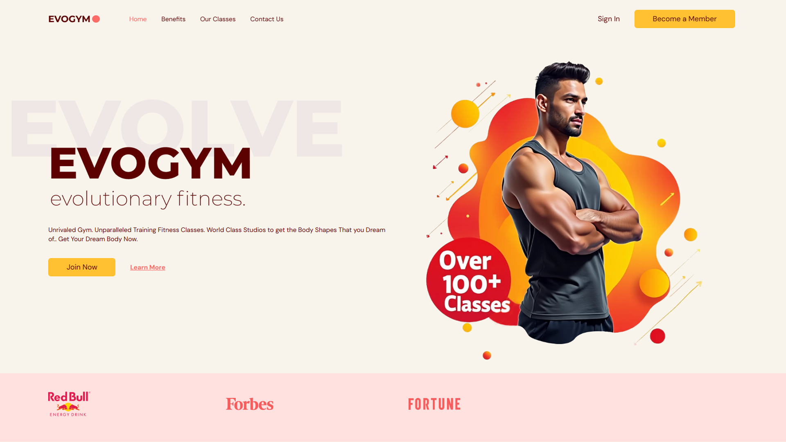
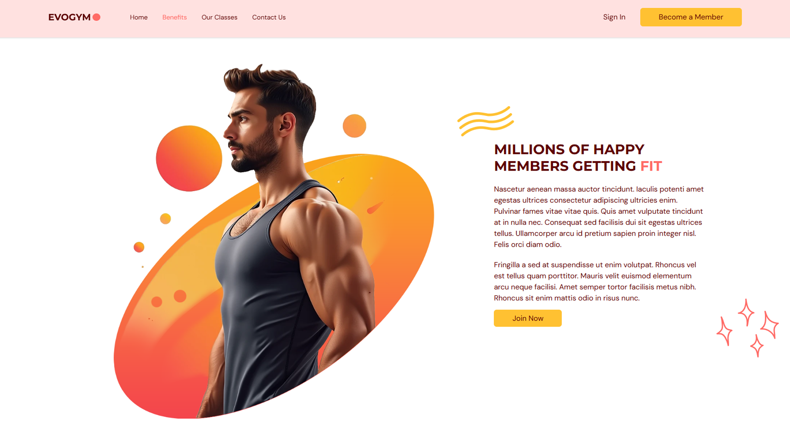
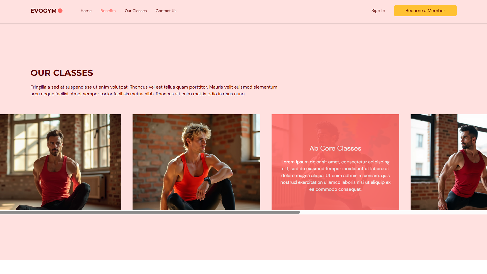
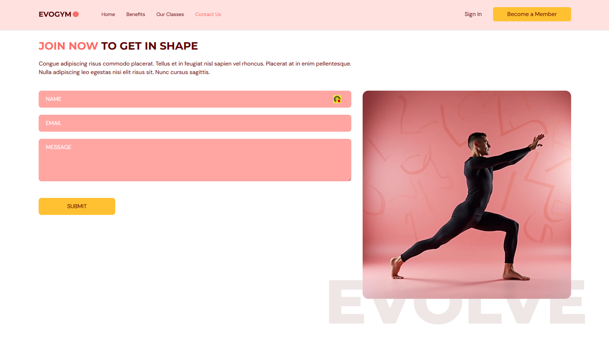

# EVOGYM

**Live Demo**: [Visit EVOGYM](https://evogym-5dm.pages.dev/)

Welcome to **EVOGYM** – a modern and responsive gym website created using the latest web technologies. This project was built as part of an educational tutorial by [EdRoh](https://www.youtube.com/@EdRohDev), and it's a great showcase of a full-stack developer's ability to create dynamic, visually appealing web applications.

## 🛠 Technologies Used

-   **Vite**: Super-fast build tool that made project setup and development a breeze.
-   **React with TypeScript**: Combined the power of React with TypeScript to create a robust, scalable application.
-   **Tailwind CSS**: Leveraged utility-first CSS for rapid UI development.
-   **Framer Motion**: Added smooth, fluid animations to enhance user interaction.
-   **Hero Icons**: Used beautiful SVG icons to enhance the visual appeal.
-   **React Hook Form**: Simplified form management, making validation and handling user inputs easy.
-   **FormSubmit.co**: Integrated with FormSubmit to send form submissions directly to my email.
-   **Flux**: Generated all website images using the advanced Flux text-to-image model.

## 📸 Project Preview

Here are some screenshots of EVOGYM in action:






## ✨ Features

-   **Fully Responsive Design**: Optimized for mobile, tablet, and desktop views.
-   **Interactive Animations**: Used Framer Motion to make the website feel alive.
-   **Contact Form**: Easily get in touch through a fully functional contact form.
-   **Custom Visuals**: All visuals are uniquely generated using Flux.

## 🚀 Getting Started

To run this project locally:

1. Clone the repository
    ```bash
    git clone https://github.com/abdoSamehDev/evogym.git
    ```
2. Navigate to the project directory

```bash
cd evogym
```

3. Install dependencies

```bash
npm installbash
```

4. Start the development server

```bash
npm run dev
```

## 📚 Learning Outcomes

Through this project, I’ve deepened my understanding of React and TypeScript, honed my CSS skills with Tailwind, and explored the power of Framer Motion for creating smooth, engaging animations.

## 🎥 Acknowledgments

A big shoutout to [EdRoh](https://www.youtube.com/@EdRohDev) for the insightful tutorial that inspired this project. You can check out the full tutorial here: [Build a Complete Typescript React Fitness Application for Beginners | Responsive](https://www.youtube.com/watch?v=I2NNxr3WPDo).

## 📬 Contact

I’m open to feedback, questions, or collaboration opportunities! Feel free to reach out via `abdosamehdev@gmail.com` or connect with me on LinkedIn.
